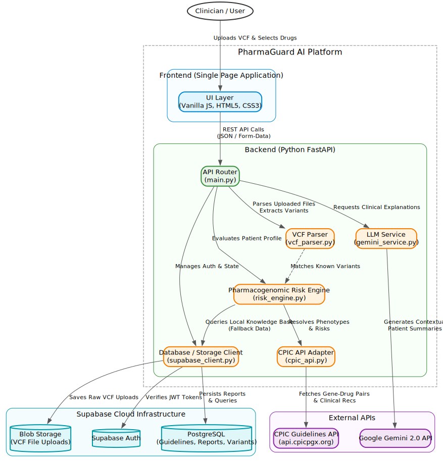

# PharmaGuard AI

**AI-Powered Pharmacogenomic Risk Analysis**


[](https://pharma-guard-iota.vercel.app/)
[](https://pharmaguard-f2fy.onrender.com)
[](https://www.linkedin.com/posts/viseshbajpai04_rift2026-hackathon-activity-7430411401468465152-rXpm?utm_source=share&utm_medium=member_desktop&rcm=ACoAAFcNs-EB1OBHtXz1qrrmadVei80a4uN-yvk)
[](https://python.org)
[](https://fastapi.tiangolo.com)
[](https://ai.google.dev)

---

## Table of Contents

- [Overview](#overview)
- [Live Demo](#live-demo)
- [Architecture](#architecture)
- [Tech Stack](#tech-stack)
- [Features](#features)
- [Supported Drugs & Genes](#supported-drugs--genes)
- [Installation](#installation)
- [API Documentation](#api-documentation)
- [Usage Examples](#usage-examples)
- [Sample VCF Files](#sample-vcf-files)
- [Project Structure](#project-structure)
- [Testing](#testing)
- [Deployment](#deployment)
- [Team Members](#team-members)
- [License & Disclaimer](#license--disclaimer)

---

## Overview

Adverse drug reactions (ADRs) kill **over 100,000 Americans annually**. Many of these deaths are preventable through pharmacogenomic testing — analyzing how an individual's genetic variants affect drug metabolism.

**PharmaGuard AI** bridges the gap between raw genetic data and clinical decision-making. It analyzes patient VCF (Variant Call Format) files against a curated pharmacogenomic knowledge base, predicts drug-specific risks aligned with **CPIC (Clinical Pharmacogenetics Implementation Consortium)** guidelines, and generates AI-powered clinical explanations using **Google Gemini 2.0 Flash**.

### Key Highlights

- Upload a standard VCF file and select one or more medications
- Automatically detect pharmacogenomic variants across 6 critical genes (35+ known variants)
- Receive color-coded risk assessments: **Safe**, **Adjust Dosage**, **Toxic**, or **Ineffective**
- Get AI-generated clinical summaries with biological mechanisms and patient-friendly language
- Save reports to a personal dashboard with Supabase-backed authentication and storage

---

## Live Demo

| Resource | Link |
|----------|------|
| **Live Application (Vercel)** | [pharma-guard-iota.vercel.app](https://pharma-guard-iota.vercel.app/) |
| **Live Application (Render)** | [pharmaguard-f2fy.onrender.com](https://pharmaguard-f2fy.onrender.com) |
| **LinkedIn Video Demo** | [https://www.linkedin.com/posts/viseshbajpai04_rift2026-hackathon-activity-7430411401468465152-rXpm?utm_source=share&utm_medium=member_desktop&rcm=ACoAAFcNs-EB1OBHtXz1qrrmadVei80a4uN-yvk](https://www.linkedin.com/posts/viseshbajpai04_rift2026-hackathon-activity-7430411401468465152-rXpm?utm_source=share&utm_medium=member_desktop&rcm=ACoAAFcNs-EB1OBHtXz1qrrmadVei80a4uN-yvk)


---

## Architecture

The system follows a layered architecture with a clear separation between the frontend SPA, the FastAPI backend processing pipeline, Supabase cloud infrastructure, and external APIs.



### Data Flow

1. **Clinician uploads a VCF file** and selects target drugs via the frontend SPA.
2. The **UI Layer** sends a REST API call (`POST /api/analyze`) with the file and drug list as `FormData`.
3. The **API Router** (`main.py`) orchestrates the analysis pipeline:
   - **VCF Parser** (`vcf_parser.py`) — Parses the uploaded file, extracts variants, and matches them against the known variant database using a 3-strategy approach (INFO tags → rsID fallback → gene tag).
   - **Pharmacogenomic Risk Engine** (`risk_engine.py`) — Determines diplotypes, calculates activity scores, derives phenotypes (PM/IM/NM/RM/URM), and maps them to CPIC-aligned risk assessments and clinical recommendations.
   - **CPIC API Adapter** (`cpic_api.py`) — Queries the official CPIC API (`api.cpicpgx.org`) for gene-drug pairs and clinical recommendations covering 34 genes and 164+ drugs.
   - **LLM Service** (`gemini_service.py`) — Sends structured prompts to Google Gemini 2.0 to generate contextual clinical summaries, biological mechanisms, and patient-friendly explanations.
4. The **Database / Storage Client** (`supabase_client.py`) handles:
   - **JWT token verification** via Supabase Auth
   - **Report persistence** to PostgreSQL (guidelines, reports, variants)
   - **Raw VCF file storage** to Supabase Blob Storage
5. Structured JSON results are returned to the frontend and rendered as interactive, color-coded risk cards.

---

## Tech Stack

| Layer | Technology | Purpose |
|-------|-----------|---------|
| **Frontend** | Vanilla JS, HTML5, CSS3 | Single Page Application with drag-and-drop upload, drug selection pills, and expandable result cards |
| **Backend** | Python 3.11, FastAPI | REST API server, request validation, pipeline orchestration |
| **AI Engine** | Google Gemini 2.0 Flash | Clinical explanation generation with structured JSON output |
| **VCF Parsing** | Custom Python parser | 3-strategy variant matching (INFO tags, rsID lookup, gene tag fallback) |
| **Risk Engine** | CPIC-aligned rule engine | Diplotype → phenotype → risk matrix with clinical recommendations |
| **External API** | CPIC API (`api.cpicpgx.org`) | Official pharmacogenomic guidelines (34 genes, 164+ drugs) |
| **Database** | Supabase (PostgreSQL) | Patient reports, CPIC guidelines, known variants, allele activity scores |
| **Auth** | Supabase Auth | JWT-based authentication with Row Level Security (RLS) |
| **Storage** | Supabase Blob Storage | Secure VCF file uploads isolated per clinician |
| **Data Models** | Pydantic v2 | Request/response validation and JSON schema enforcement |
| **Deployment** | Docker + Render | Containerized production deployment |

---

## Features

- **VCF File Upload** — Drag-and-drop or file picker with client-side validation (extension, size ≤ 5 MB, header check)
- **Multi-Drug Analysis** — Click drug pills or type comma-separated names; supports 6 CPIC drugs + aliases (e.g., Plavix → Clopidogrel, 5-FU → Fluorouracil)
- **Color-Coded Risk Cards** — Green (Safe), Yellow (Adjust Dosage), Red (Toxic/Ineffective) with confidence scores and severity levels
- **Expandable Result Sections** — Pharmacogenomic profile, clinical recommendation, AI explanation, quality metrics, and raw JSON output
- **AI-Generated Explanations** — Gemini-powered summaries with biological mechanisms, variant-specific effects, patient-friendly language, and citations
- **CPIC API Integration** — Real-time lookups against the official CPIC database for the most current guideline data
- **Authentication & Dashboard** — Supabase Auth with JWT tokens; save, view, and delete analysis reports from a personal dashboard
- **VCF Storage** — Uploaded VCF files stored securely in Supabase Blob Storage, isolated per user
- **Row Level Security** — PostgreSQL RLS ensures clinicians can only access their own patient reports
- **JSON Export** — Copy-to-clipboard or download JSON per drug or full analysis
- **Robust Parsing** — 3-strategy variant matching, `0/0` genotype filtering, graceful fallback for malformed VCFs
- **Fallback Logic** — If Gemini API is unavailable, the system generates rule-based explanations; if CPIC API is down, hardcoded data is used

---

## Supported Drugs & Genes

| Drug | Primary Gene | Drug Class | Key Clinical Risk |
|------|-------------|------------|-------------------|
| **Codeine** | CYP2D6 | Opioid analgesic | PMs get no pain relief; URMs risk respiratory depression |
| **Warfarin** | CYP2C9 | Anticoagulant | PMs face critical bleeding risk |
| **Clopidogrel** | CYP2C19 | Antiplatelet | PMs cannot activate the prodrug → treatment failure |
| **Simvastatin** | SLCO1B1 | Statin | PMs face high myopathy / rhabdomyolysis risk |
| **Azathioprine** | TPMT | Immunosuppressant | PMs face life-threatening myelosuppression |
| **Fluorouracil** | DPYD | Antineoplastic | PMs face fatal toxicity from DPD deficiency |

**Aliases supported:** 5-FU, 5-Fluorouracil, Capecitabine → Fluorouracil | 6-MP, Mercaptopurine → Azathioprine | Plavix → Clopidogrel | Coumadin → Warfarin | Zocor → Simvastatin

---

## Installation

### Prerequisites

- Python 3.10+
- Google Gemini API key ([get one here](https://aistudio.google.com/apikey))
- *(Optional)* Supabase project for auth, dashboard, and storage ([supabase.com](https://supabase.com))

### Local Setup

```bash
# 1. Clone the repository
git clone https://github.com/Veebeeo/PharmaGuard.git
cd PharmaGuard

# 2. Set up backend environment variables
cd backend
cp .env.example .env
# Edit .env and add:
#   GOOGLE_API_KEY=your_gemini_api_key
#   SUPABASE_URL=https://your-project.supabase.co   (optional)
#   SUPABASE_KEY=your_service_role_key               (optional)

# 3. Set up frontend environment variables
cd ../frontend
cp .env.example .env
# Edit .env and add:
#   SUPABASE_ANON_KEY=your_supabase_anon_key

# 4. Install Python dependencies
cd ../backend
pip install -r requirements.txt

# 5. Run the development server
uvicorn main:app --reload --port 8000

# 6. Open in browser
# http://localhost:8000
```

> **Note:** Without Supabase credentials, the app runs in public mode — analysis works via `/api/analyze` but authentication, dashboard, and report saving are disabled.

### Docker

```bash
docker build -t pharmaguard-ai .
docker run -p 10000:10000 \
  -e GOOGLE_API_KEY=your_key_here \
  -e SUPABASE_URL=your_url \
  -e SUPABASE_KEY=your_key \
  pharmaguard-ai
```

### Supabase Database Setup

If using Supabase for the full experience (auth + dashboard + storage):

1. Create a new project at [supabase.com](https://supabase.com)
2. Open **SQL Editor** and run the entire `supabase_schema.sql` file — this creates all tables, RLS policies, and seeds the pharmacogenomic reference data
3. Create a **Storage bucket** named `vcf-uploads` (private) via Dashboard → Storage
4. Copy your project URL and service role key into `.env`

---

### Supabase Database Setup

If using Supabase for the full experience (auth + dashboard + storage):

1. Create a new project at [supabase.com](https://supabase.com)
2. Open **SQL Editor** and run the entire `supabase_schema.sql` file — this creates all tables, RLS policies, and seeds the pharmacogenomic reference data
3. Create a **Storage bucket** named `vcf-uploads` (private) via Dashboard → Storage
4. Copy your project URL and service role key into `.env`

---

## API Documentation

### `POST /api/analyze`

Public endpoint — analyze a VCF file against one or more drugs.

**Request** (`multipart/form-data`):

| Field | Type | Description |
|-------|------|-------------|
| `vcf_file` | File | VCF file (`.vcf`, max 5 MB) |
| `drugs` | String | Comma-separated drug names (e.g., `CODEINE,WARFARIN`) |

**Response** (`MultiDrugResponse`):

```json
{
  "results": [
    {
      "patient_id": "PATIENT_001",
      "drug": "CODEINE",
      "timestamp": "2026-02-19T12:00:00Z",
      "risk_assessment": {
        "risk_label": "Ineffective",
        "confidence_score": 0.95,
        "severity": "high"
      },
      "pharmacogenomic_profile": {
        "primary_gene": "CYP2D6",
        "diplotype": "*4/*6",
        "phenotype": "PM",
        "detected_variants": [
          {
            "rsid": "rs3892097",
            "gene": "CYP2D6",
            "star_allele": "*4",
            "genotype": "0/1",
            "functional_effect": "no_function"
          }
        ]
      },
      "clinical_recommendation": {
        "dosing_recommendation": "AVOID codeine. PMs cannot convert codeine to morphine.",
        "alternative_drugs": ["Morphine", "Hydromorphone", "Non-opioid analgesics"],
        "monitoring_parameters": ["Pain control with alternative"],
        "cpic_guideline_reference": "CPIC Guideline for CYP2D6 and Codeine Therapy (2019)",
        "urgency": "urgent"
      },
      "llm_generated_explanation": {
        "summary": "Patient carries CYP2D6 *4/*6, classified as Poor Metabolizer...",
        "mechanism": "CYP2D6 O-demethylates codeine to its active metabolite morphine...",
        "variant_specific_effects": ["rs3892097 (*4): Splicing defect, no enzyme function"],
        "patient_friendly_summary": "Your body cannot convert this pain medication into its active form...",
        "citations": ["CPIC Guideline for CYP2D6 and Codeine Therapy"],
        "model_used": "gemini-2.0-flash"
      },
      "quality_metrics": {
        "vcf_parsing_success": true,
        "total_variants_parsed": 7,
        "pharmacogenomic_variants_found": 7,
        "gene_coverage": ["CYP2C19", "CYP2C9", "CYP2D6", "DPYD", "SLCO1B1", "TPMT"]
      }
    }
  ],
  "total_drugs_analyzed": 1,
  "analysis_id": "abc12345"
}
```

### `POST /api/analyze-secure`

Authenticated endpoint — same as above, but requires a Bearer token. Additionally uploads the VCF to Supabase Storage and saves the report to the dashboard.

**Headers:** `Authorization: Bearer <access_token>`

### `POST /api/auth/signup`

Create a new account.

**Body:** `{ "email": "doctor@hospital.com", "password": "securepass" }`

### `POST /api/auth/login`

Sign in and receive an access token.

**Body:** `{ "email": "doctor@hospital.com", "password": "securepass" }`

**Response:** `{ "success": true, "access_token": "...", "user": { "id": "...", "email": "..." } }`

### `GET /api/health`

Returns API status, Gemini configuration status, Supabase status, and supported drugs.

### `GET /api/supported-drugs`

Returns the list of supported drugs with gene mappings, aliases, and drug classes.

### `GET /api/cpic-pairs`

Returns all Level A and B gene-drug pairs from the official CPIC database.

### `GET /api/dashboard`

*(Auth required)* Returns the current user's saved reports.

### `GET /api/dashboard/{report_id}`

*(Auth required)* Returns a single report with full JSON detail.

### `DELETE /api/dashboard/{report_id}`

*(Auth required)* Deletes a saved report.

---

## Usage Examples

### Example 1: High-Risk Patient (Codeine)

Upload `patient_001.vcf` → Select **Codeine**

| Field | Result |
|-------|--------|
| **Risk** | ⛔ **Ineffective** (high severity, 95% confidence) |
| **Diplotype** | CYP2D6 *4/*6 → Poor Metabolizer |
| **Mechanism** | Patient cannot convert codeine to morphine → no analgesic effect |
| **Recommendation** | AVOID codeine; use morphine, hydromorphone, or NSAIDs |
| **Urgency** | Urgent |

### Example 2: Multi-Drug Analysis

Upload `patient_002.vcf` → Select **All Drugs**

| Drug | Risk | Gene | Phenotype |
|------|------|------|-----------|
| Clopidogrel | ⛔ Ineffective | CYP2C19 *2/*2 | Poor Metabolizer |
| Fluorouracil | ⚠️ Adjust Dosage | DPYD *2A/*13 | Intermediate Metabolizer |
| Codeine | ✅ Safe | CYP2D6 (no variants) | Normal Metabolizer |
| Warfarin | ✅ Safe | CYP2C9 (no variants) | Normal Metabolizer |
| Simvastatin | ✅ Safe | SLCO1B1 (no variants) | Normal Metabolizer |
| Azathioprine | ✅ Safe | TPMT (no variants) | Normal Metabolizer |

### Example 3: Normal Patient

Upload `patient_003.vcf` → Select **Codeine, Clopidogrel**

| Drug | Risk | Phenotype |
|------|------|-----------|
| Codeine | ✅ Safe | CYP2D6 *2 → Normal Metabolizer |
| Clopidogrel | ✅ Safe | CYP2C19 *17 → Normal/Rapid Metabolizer |

---

## Sample VCF Files

Three test files are included in `backend/sample_vcfs/`:

| File | Key Variants | Expected Results |
|------|-------------|-----------------|
| `patient_001.vcf` | CYP2D6 *4/*6, CYP2C9 *1/*2, SLCO1B1 *1/*5 | Codeine: Ineffective, Simvastatin: Adjust |
| `patient_002.vcf` | CYP2C19 *2/*2, DPYD *2A/*13 | Clopidogrel: Ineffective, 5-FU: Adjust |
| `patient_003.vcf` | CYP2D6 *2 (normal), CYP2C19 *17 | Codeine: Safe, Clopidogrel: Safe |

---

## Project Structure

```
pharmaguard-ai/
├── backend/
│   ├── main.py                 # FastAPI app, routes, pipeline orchestration
│   ├── vcf_parser.py           # VCF file parsing & variant extraction
│   ├── risk_engine.py          # Pharmacogenomic knowledge base & risk matrix
│   ├── gemini_service.py       # Google Gemini API integration
│   ├── cpic_api.py             # Official CPIC API client (34 genes, 164+ drugs)
│   ├── supabase_client.py      # Supabase DB, auth, and storage client
│   ├── models.py               # Pydantic v2 response models
│   ├── requirements.txt        # Python dependencies
│   ├── .env.example            # Environment variable template
│   └── sample_vcfs/
│       ├── patient_001.vcf     # High-risk test case
│       ├── patient_002.vcf     # Multi-drug test case
│       └── patient_003.vcf     # Normal patient test case
├── frontend/
│   ├── index.html              # Single Page Application (all views)
│   ├── css/
│   │   └── styles.css          # Professional medical-grade light theme
│   ├── js/
│   │   └── app.js              # Client-side logic, auth, API calls, rendering
│   └── assets/
│       └── dna-bg.png          # Landing page background
├── tests/
│   ├── test_api.py             # API endpoint integration tests
│   ├── test_risk_engine.py     # Risk engine unit tests
│   └── test_llm_eval.py        # Gemini output validation tests
├── Dockerfile                  # Production container definition
├── render.yaml                 # Render deployment configuration
├── supabase_schema.sql         # Full database schema + seed data
├── pytest.ini                  # Test configuration
├── .gitignore
└── README.md
```

---

## Testing

```bash
# Run all tests
pytest tests/ -v

# Run specific test suites
pytest tests/test_risk_engine.py -v    # Unit tests for phenotype & risk logic
pytest tests/test_api.py -v            # Integration tests for API endpoints
pytest tests/test_llm_eval.py -v       # Gemini output validation (requires API key)
```

### Test Coverage

| Suite | What It Tests |
|-------|--------------|
| `test_risk_engine.py` | Phenotype determination (PM/IM/NM/RM/URM), risk assessment logic, unsupported drug handling |
| `test_api.py` | Health check endpoint, `/api/analyze` with a real VCF, diplotype extraction |
| `test_llm_eval.py` | Gemini response schema adherence, factuality checks, hallucination detection |

---

## Deployment

### Deploy to Render

1. Push your repository to GitHub
2. Create a new **Web Service** on [Render](https://render.com)
3. Connect your GitHub repository
4. Set environment to **Docker**
5. Add environment variables:
   - `GOOGLE_API_KEY` — your Gemini API key
   - `SUPABASE_URL` — your Supabase project URL *(optional)*
   - `SUPABASE_KEY` — your Supabase service role key *(optional)*
6. Deploy — the app will be available at your Render URL

The included `render.yaml` provides the deployment configuration.

### Deploy Frontend to Vercel (Optional)

If serving the frontend separately:

1. Push the `frontend/` directory to a separate repo or configure Vercel to use it as the root
2. Update the `API` variable in `frontend/js/app.js` to point to your Render backend URL
3. Update CORS origins in `backend/main.py` to include your Vercel domain

---

## Team Members

| Name | Role |
|------|------|
| **[Visesh Bajpai]** | Full-stack development, pharmacogenomics engine, AI integration |
| **[Suryansh Vaish]** | [Role — Testing, documentation] |

---

## License & Disclaimer

**MIT License** — For research and educational purposes only.

> ⚠️ **PharmaGuard AI** is developed for the **RIFT 2026 Hackathon** and is intended for research and educational purposes only. It is **not a medical device** and should not be used as a substitute for professional pharmacogenomic testing or clinical judgment. Always consult a qualified healthcare provider before making medication decisions.

---

**#RIFT2026 #PharmaGuard #Pharmacogenomics #AIinHealthcare #CPIC #PrecisionMedicine**
